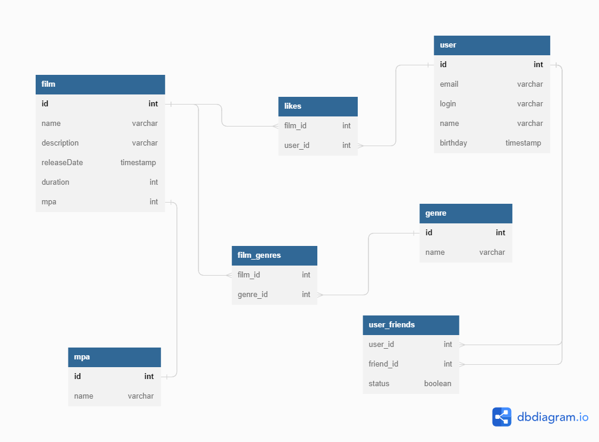

# java-filmorate
Template repository for Filmorate project.
### Схема БД
<picture>
    <source media="(prefers-color-scheme: dark)" srcset="src/main/resources/DB.png">
    
</picture>

### Код из dbdiagram.io
```
Table film {
id int [pk, increment]
name varchar [not null]
description varchar
releaseDate timestamp
duration int
mpa int 
}
Table user {
id int [pk, increment]
email varchar [unique, not null]
login varchar [not null]
name varchar
birthday timestamp
}
Table likes {
film_id int
user_id int
}
Table genre {
id int [pk, increment]
name varchar [not null]
}
Table film_genres {
film_id int
genre_id int
}
Table mpa {
id int [pk, increment]
name varchar [not null]
}
Table user_friends {
user_id int
friend_id int
status boolean
}
Ref: film_genres.film_id > film.id
Ref: film_genres.genre_id > genre.id
Ref: likes.film_id > film.id
Ref: likes.user_id > user.id
Ref: user_friends.user_id > user.id
Ref: user_friends.friend_id > user.id
Ref: film.mpa - mpa.id
```
получение всех фильмов 
SELECT*
FROM FILM

Получение фильма по id 1 
SELECT* 
FROM FILm
WHERE ID = 1;

получение фильмов, отсортированных по количеству лайков 
SELECT COUNT(L.ID) as likeRate,
FILM.ID,FILM.NAME,FILM.DESCRIPTION,RELEASEDATE,DURATION,MPA,R.ID,R.NAME
FROM FILM
LEFT JOIN LIKES L on L.FILM_ID = FILM.ID
INNER JOIN MPA R ON R.ID = FILM.MPA
GROUP BY FILM.ID
ORDER BY likeRate desc;


Получение пользлователя по id 1 
SELECT* 
FROM USER
WHERE ID = 1

получение всех пользователей 
SELECT* 
FROM USER

получение всех друзей пользователя c id 1 
SELECT FRIEND_ID 
FROM USER_FRIENDS 
WHERE ID = 1

